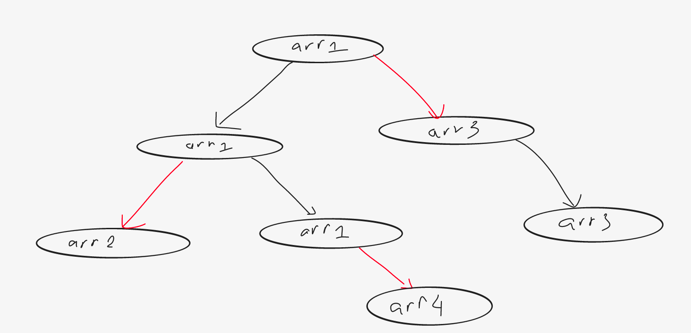

## Abstract
You have to maintain a list of arrays. Initially, you have a single array $a_1, a_2, ..., a_n$ (array $1$). You have to process three types of queries:
1. Change the value at index $p$ of array $k$ to $x$.
2. Return the sum in range $[a, b]$ of array $k$.
3. Create a copy of array $k$ and append as the last array.

## Tutorial

Lets check out the image above which is a illustrated tree of _applying queries_ in this problem. Where
- Each node illustrate a version of a particular array.
- Each direct edge denotes as a query (red for query 3 and black for the others).

Therefore, for each queries we have to create new version of array. So data structure `persitent` is what we need to solve this problem.

For more meanings, `persistent` is a data structure that always preverse version itself  when it modified (in this problem, it's applied query).

So how should we apply `persistent` in this problem?

Let's define a array has a number of version. The array 1 will have version 1. So when applying a query, a new version is created. And we will update the version corresponding to the array. More details, 
- If the query is 1 or 2, the last version is the version of the current array $k$.
- Else, the last version is the version of new array.

Conclusion, we have to store the latest version of each array and for a query we need to create new version from the version of corresponding considered array.

The pseudo code as follow:
```python
    cur_ver = 2 # version 1 corresponds to array 1
    ver = []
    latest_ver = []
    for q in Q:
        array_k, update_info = q
        update(q, latest_ver[array_k], cur_ver)
        latest_ver[array_k] = cur_ver
        cur_ver += 1
```

The complexity of above alogrithm is $O(np)$ which $p$ the complexity of updating. We can use a popular data structure `Segment Tree` to implement the update function in $O(logn)$. But in this problem, it's a bit difficult that we have to combine 2 data structures above together.

_Written by Tuan Huynh (11 - 9 - 2021)_